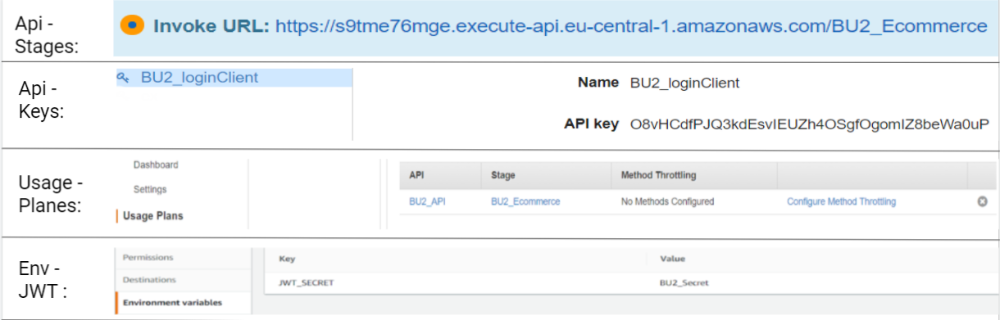
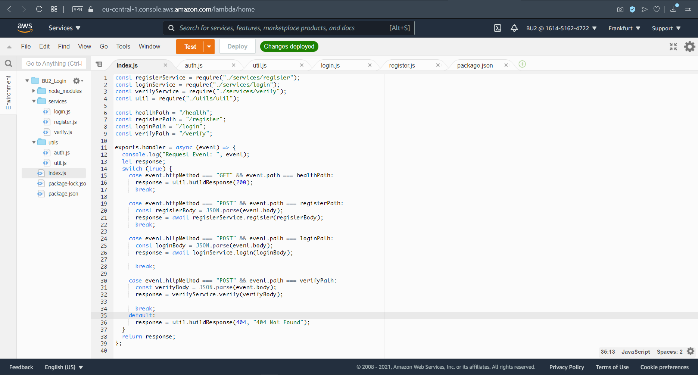
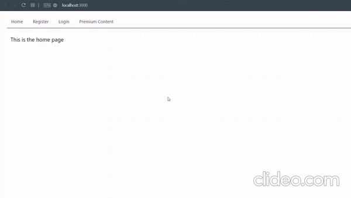

# Register-Login-System-on-AWS
Complete Register/Login System on AWS with React.js and a Serverless API

Register / login system on AWS from scratch. The backend is a node.js serverless API with a dynamodb for user information storage (UserType, username, password). It uses bcrypt to encrypt passwords and uses jwt to generate tokens. The frontend is built with react.js.

## Installation

 ```sh
•	cd frontend

•	npm install

•	npm start
```

## Usage
#### Check Images Below
 ```sh
•	Create AWS API Gatway then Link it with Lambda Function

•	Create Dynamodb table

•	Create Api-stage then generate API key && API plan

•	Create your own JWT from config in lambda function section
```
## AWS API config



#### deploy backend code to aws lambda


## Demo


## Refernces
Website to learn more about aws: https://jinmeister.com

## MoreInfo
[linkedin](https://www.linkedin.com/in/ayman-butmah-816b361b3/)
